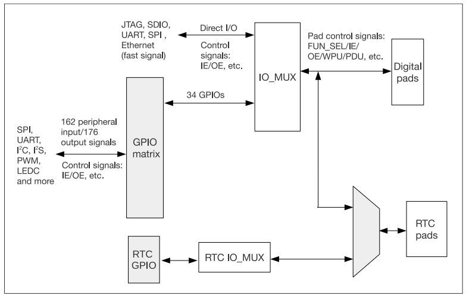

# ระบบ GPIO ของ ESP32

ขาทั้งหมดของ ESP32 สามารถทำงานได้ทุก function ยกเว้นที่ได้ระบุไว้เป็นพิเศษ โดยการใส่วงจร GPIO matrix และ IO Multiplexer ไว้ในระบบ ทำให้ผู้ใช้มีความยืดหยุ่นในการออกแบบ hardware ของ  end product

รูปที่ 1 แสดงแผนผังการเชื่อมต่อขาของ ESP32 ไปยังอุปกรณ์ภายนอก

เนื่องจากความซับซ้อนในการเชื่อมต่อ ผู้ใช้ต้องทำการกำหนดเส้นทางการเชื่อมต่อให้กับระบบ เพื่อเชื่อมต่อไปยังภายนอกให้ถูกต้อง ซึ่งการกำหนดค่าต่าง ๆ สามารถทำได้ทั้งตอนเริ่มโปรแกรม หรือใน loop รวมทั้ง task ต่าง ๆ 

