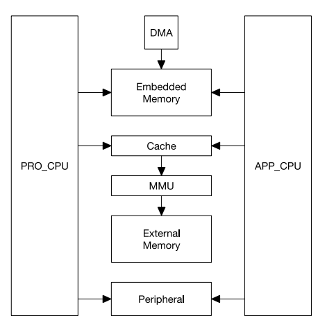
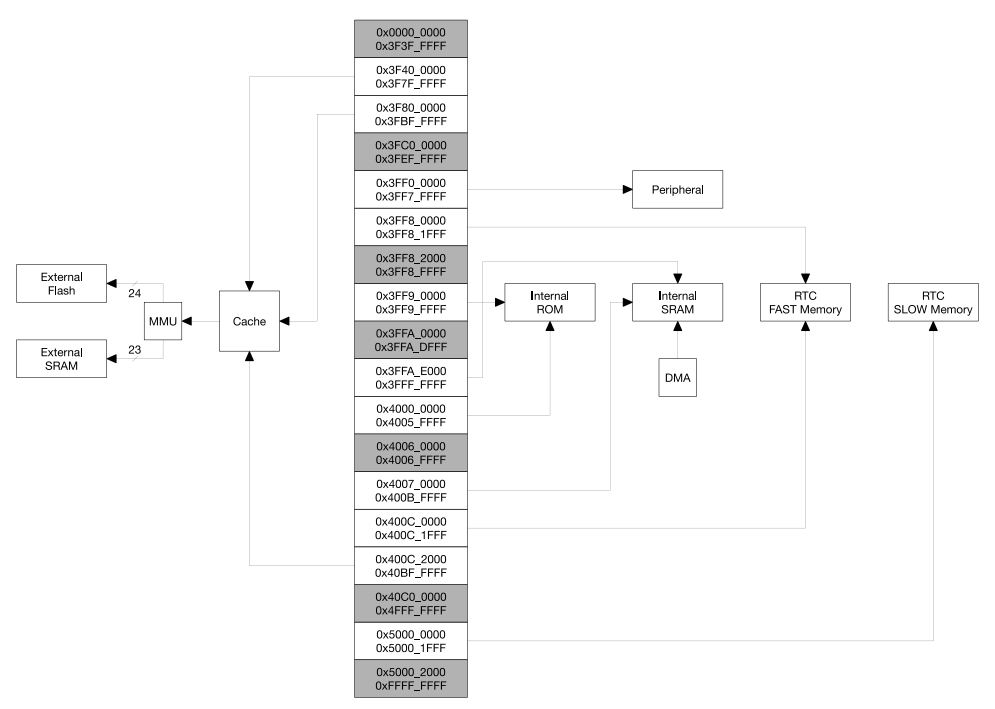
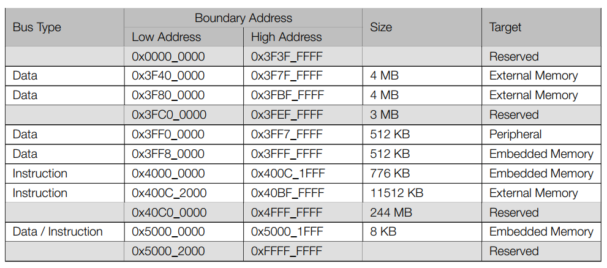
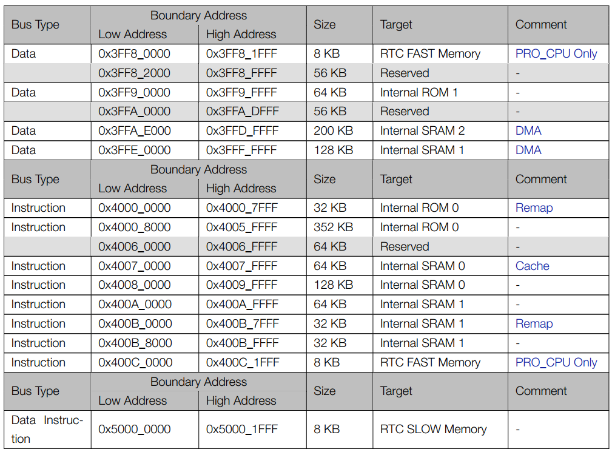

# ESP32

ESP32 เป็นระบบไมโครคอนโทรลเลอร์แบบ dual core ซึ่งมี CPU สถาปัตยกรรม Harward ของบริษัท Xtensa รุ่น LX6 จำนวนสองตัวอยู่ภายในชิปเดียวกัน
โดย MCU ทั้งสองตัวสามารถเข้าถึงตำแหน่งหน่วยความจำเดียวกัน นั่นคือสามารถใช้อุปกรณ์ต่อพ่วงในชิปร่วมกันได้ทั้งหมด ซึ่งอุปกรณ์ต่อพ่วงเหล่านั้นสามารถเข้าถึงได้แบบ DMA ทำให้ระบบมีประสิทธิภาพในการทำงานที่สูง เนื่องจากไม่ต้องพึ่งพาการทำงานทั้งหมดโดย CPU

CPU  ทั้งสองตัวมืชื่อเรียกว่า PRO_CPU สำหรับโปรโตคอล และ APP_CPU สำหรับแอพพลิเคชัน แต่โดยปกติ CPU ทั้งสองตัวสามารถใช้งานแทนกันได้ 
[reference](https://www.espressif.com/sites/default/files/documentation/esp32_technical_reference_manual_en.pdf#iomuxgpio)

รูปที่ 1 โครงสร้างของระบบ

## ความสามารถของ ESP32

### การเข้าถึงหน่วยความจำ 

– การอ้างถึงแบบ Symmetric address mapping
– บัสคำสั่งและบัสข้อมูลขนาด 4 GB (32-bit) (ทั้งภายในและภายนอกชิป)  
– หน่วยความจำภายในชิป 1296 KB
– หน่วยความจำภายนอกชิป 19704 KB
– การอ้างถึงอุปกรณ์ต่อพ่วง 512 KB
– ตำแหน่งหน่วยความจำ สามารถอ้างถึงได้ทั้งจาก data bus  และ instruction bus
– DMA 328 KB 

### หน่วยความจำภายในชิป

– หน่วยความจำ ROM  448 KB 
– หน่วยความจำ RAM 520 KB
– หน่วยความจำ RTC (FAST Memory) 8 KB  
– หน่วยความจำ RTC (SLOW Memory) 8 KB  

### หน่วยความจำภายนอกชิป

การเชื่อมต่อหน่วยความจำภายนอก สามารถเชื่อมได้ทางพอร์ต SPI โดยสามารถนำบางส่วนของหน่วยความจำภายในมาทำเป็น cache เพื่อเพิ่มความเร็วในการทำงาน เนื่องจาก  CPU สามารถเข้าถึงหน่วยความจำภายในได้เร็วกว่า

– สามารถเชื่อมต่อกับหน่วยความจำภายนอกแบบ SPI ได้สูงสุด  16 MB 
– สามารถเชื่อมต่อกับหน่วยความจำภายนอกแบบ SPI SRAM ได้ 8 MB

รูปที่ 2 แผนผังการเข้าถึงหน่วยความจำ

### อุปกรณ์ต่อพ่วง

– จำนวน 41 รายการ

###  DMA

– จำนวนสูงสุด 13 โมดูล

 ## การอ้างตำแหน่งใน ESP32

 ใน ESP32 มี CPU จำนวนสองตัวที่สามารถเข้าถึงหน่วยความจำได้ทั้งหมด 4GB  (32 บิต) ได้อย่างเท่าเทียมกัน โดยตำแหน่งหน่วยความจำจะแบ่งได้เป็น 3 ส่วนใหญ่ๆ คือ
 1. ในช่วง 0x0000_0000 ถึง 0x3FFF_FFFF  เป็นตำแหน่งหน่วยความจำที่ไว้เก็บข้อมูล เข้าถึงได้ทาง data bus (บางส่วนสงวนไว้ ไม่สามารถใช้ได้)
 2.  ในช่วง 0x4000_0000 ถึง 0x4FFF_FFFF  เป็นตำแหน่งหน่วยความจำที่ไว้เก็บคำสั่ง เข้าถึงได้ทาง instruction bus (บางส่วนสงวนไว้ ไม่สามารถใช้ได้)
 3.  ในช่วง 0x5000_0000 ถึง 0xFFFF_FFFF  เป็นตำแหน่งหน่วยความจำที่ใช้ได้ทั้ง data และ instruction (บางส่วนสงวนไว้ ไม่สามารถใช้ได้)

ทั้ง data และ instauction bus ต่างก็เข้าถึงข้อมูลแบบ little endean 
The data bus and instruction bus are both little-endian: for example, byte addresses 0x0, 0x1, 0x2, 0x3 access
the least significant, second least significant, second most significant, and the most significant bytes of the 32-bit
word stored at the 0x0 address, respectively. The CPU can access data bus addresses via aligned or non-aligned
byte, half-word and word read-and-write operations. The CPU can read and write data through the instruction
bus, but only in a word aligned manner; non-word-aligned access will cause a CPU exception.
Each CPU can directly access embedded memory through both the data bus and the instruction bus, external
memory which is mapped into the address space (via transparent caching & MMU), and peripherals. Table 1-1
illustrates address ranges that can be accessed by each CPU’s data bus and instruction bus.
Some embedded memories and some external memories can be accessed via the data bus or the instruction bus.
In these cases, the same memory is available to either of the CPUs at two address ranges.

(เพิ่มรูป)

### Embedded Memory

The Embedded Memory consists of four segments: internal ROM (448 KB), internal SRAM (520 KB), RTC FAST
memory (8 KB) and RTC SLOW memory (8 KB).
The 448 KB internal ROM is divided into two parts: Internal ROM 0 (384 KB) and Internal ROM 1 (64 KB). The 520
KB internal SRAM is divided into three parts: Internal SRAM 0 (192 KB), Internal SRAM 1 (128 KB), and Internal
SRAM 2 (200 KB). RTC FAST Memory and RTC SLOW Memory are both implemented as SRAM.
Table 1-2 lists all embedded memories and their address ranges on the data and instruction buses

