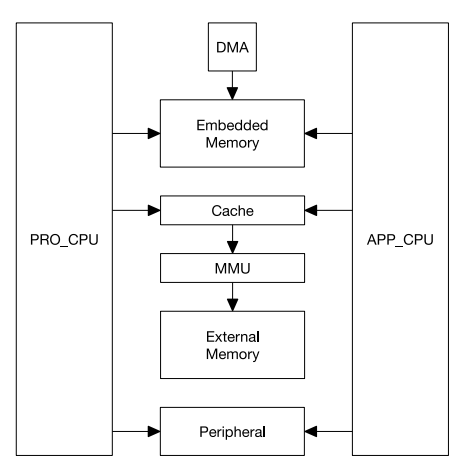
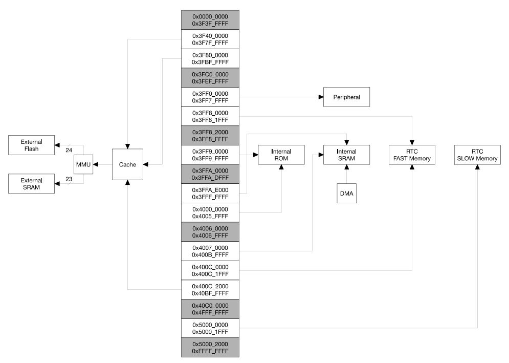
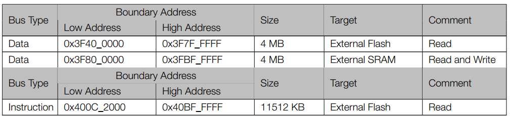
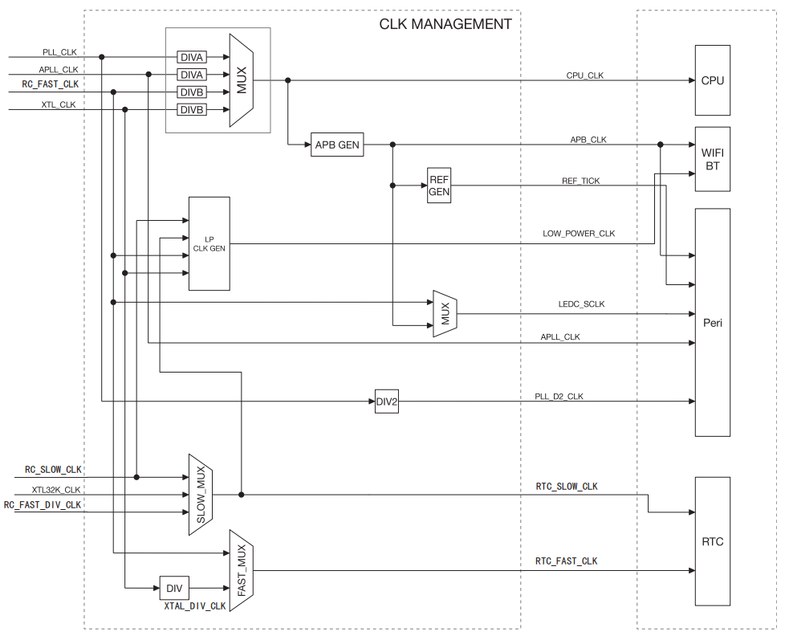

# ESP32

ESP32 เป็นระบบไมโครคอนโทรลเลอร์แบบ dual core ซึ่งมี CPU สถาปัตยกรรม Harward ของบริษัท Xtensa รุ่น LX6 จำนวนสองตัวอยู่ภายในชิปเดียวกัน
โดย MCU ทั้งสองตัวสามารถเข้าถึงตำแหน่งหน่วยความจำเดียวกัน นั่นคือสามารถใช้อุปกรณ์ต่อพ่วงในชิปร่วมกันได้ทั้งหมด ซึ่งอุปกรณ์ต่อพ่วงเหล่านั้นสามารถเข้าถึงได้แบบ DMA ทำให้ระบบมีประสิทธิภาพในการทำงานที่สูง เนื่องจากไม่ต้องพึ่งพาการทำงานทั้งหมดโดย CPU

CPU  ทั้งสองตัวมืชื่อเรียกว่า PRO_CPU สำหรับโปรโตคอล และ APP_CPU สำหรับแอพพลิเคชัน แต่โดยปกติ CPU ทั้งสองตัวสามารถใช้งานแทนกันได้ 
[reference](https://www.espressif.com/sites/default/files/documentation/esp32_technical_reference_manual_en.pdf#iomuxgpio)

รูปที่ 1 โครงสร้างของระบบ

## ความสามารถของ ESP32

### การเข้าถึงหน่วยความจำ 

– การอ้างถึงแบบ Symmetric address mapping
– บัสคำสั่งและบัสข้อมูลขนาด 4 GB (32-bit) (ทั้งภายในและภายนอกชิป)  
– หน่วยความจำภายในชิป 1296 KB
– หน่วยความจำภายนอกชิป 19704 KB
– การอ้างถึงอุปกรณ์ต่อพ่วง 512 KB
– ตำแหน่งหน่วยความจำ สามารถอ้างถึงได้ทั้งจาก data bus  และ instruction bus
– DMA 328 KB 

### หน่วยความจำภายในชิป

– หน่วยความจำ ROM  448 KB 
– หน่วยความจำ RAM 520 KB
– หน่วยความจำ RTC (FAST Memory) 8 KB  
– หน่วยความจำ RTC (SLOW Memory) 8 KB  

### หน่วยความจำภายนอกชิป

การเชื่อมต่อหน่วยความจำภายนอก สามารถเชื่อมได้ทางพอร์ต SPI โดยสามารถนำบางส่วนของหน่วยความจำภายในมาทำเป็น cache เพื่อเพิ่มความเร็วในการทำงาน เนื่องจาก  CPU สามารถเข้าถึงหน่วยความจำภายในได้เร็วกว่า

– สามารถเชื่อมต่อกับหน่วยความจำภายนอกแบบ SPI ได้สูงสุด  16 MB 
– สามารถเชื่อมต่อกับหน่วยความจำภายนอกแบบ SPI SRAM ได้ 8 MB

รูปที่ 2 แผนผังการเข้าถึงหน่วยความจำ

### อุปกรณ์ต่อพ่วง

– จำนวน 41 รายการ

###  DMA

– จำนวนสูงสุด 13 โมดูล

 ## การอ้างตำแหน่งใน ESP32

 ใน ESP32 มี CPU จำนวนสองตัวที่สามารถเข้าถึงหน่วยความจำได้ทั้งหมด 4GB  (32 บิต) ได้อย่างเท่าเทียมกัน โดยตำแหน่งหน่วยความจำจะแบ่งได้เป็น 3 ส่วนใหญ่ๆ คือ
 1. ในช่วง 0x0000_0000 ถึง 0x3FFF_FFFF  เป็นตำแหน่งหน่วยความจำที่ไว้เก็บข้อมูล เข้าถึงได้ทาง data bus (บางส่วนสงวนไว้ ไม่สามารถใช้ได้)
 2.  ในช่วง 0x4000_0000 ถึง 0x4FFF_FFFF  เป็นตำแหน่งหน่วยความจำที่ไว้เก็บคำสั่ง เข้าถึงได้ทาง instruction bus (บางส่วนสงวนไว้ ไม่สามารถใช้ได้)
 3.  ในช่วง 0x5000_0000 ถึง 0xFFFF_FFFF  เป็นตำแหน่งหน่วยความจำที่ใช้ได้ทั้ง data และ instruction (บางส่วนสงวนไว้ ไม่สามารถใช้ได้)

|Target|Size|Address Low|Address High|Bus Type|
|--|--|--|--|-|
|Reserved||0x0000_0000 |0x3F3F_FFFF||
|External Memory|4 MB|0x3F7F_FFFF |0x3F40_0000|Data|
|External Memory|4 MB|0x3F80_0000 |0x3FBF_FFFF|Data|
|Reserved|3 MB |0x3FC0_0000 |0x3FEF_FFFF||
|Peripheral|512 KB | 0x3FF0_0000 |0x3FF7_FFFF|Data|
|Embedded Memory|512 KB |0x3FF8_0000 |0x3FFF_FFFF  |Data ||
|Embedded Memory|776 KB | 0x4000_0000 |0x400C_1FFF |Instruction ||
|External Memory|11512 KB |0x400C_2000 |0x40BF_FFFF  |Instruction ||
|Reserved|244 MB | 0x40C0_0000 |0x4FFF_FFFF |||
|Embedded Memory|8 KB | 0x5000_0000 |0x5000_1FFF |Data / Instruction ||
|Reserved|| 0x5000_2000 |0xFFFF_FFFF |||

ทั้ง data และ instauction bus ต่างก็เข้าถึงข้อมูลแบบ little endean 
 

### Embedded Memory

|Bus Type|Low Address |High Address|Size |Target |Comment|
|--------|------------|------------|-----|-------|-------|
|Data |0x3FF8_0000 |0x3FF8_1FFF |8 KB |RTC FAST Memory |PRO_CPU Only|
||0x3FF8_2000 |0x3FF8_FFFF| 56 KB| Reserved |-|
|Data| 0x3FF9_0000| 0x3FF9_FFFF| 64 KB| Internal ROM 1| -|
||0x3FFA_0000| 0x3FFA_DFFF| 56 KB| Reserved| -|
|Data| 0x3FFA_E000| 0x3FFD_FFFF |200 KB| Internal SRAM 2| DMA|
|Data| 0x3FFE_0000 |0x3FFF_FFFF |128 KB| Internal SRAM 1| DMA|
|Instruction| 0x4000_0000 |0x4000_7FFF |32 KB| Internal ROM 0| Remap|
|Instruction| 0x4000_8000 |0x4005_FFFF |352 KB| Internal ROM 0| -|
||0x4006_0000| 0x4006_FFFF |64 KB |Reserved |-|
|Instruction| 0x4007_0000 |0x4007_FFFF |64 KB |Internal SRAM 0 |Cache
|Instruction| 0x4008_0000 |0x4009_FFFF |128 KB| Internal SRAM 0 |-
|Instruction| 0x400A_0000 |0x400A_FFFF |64 KB |Internal SRAM 1 |-
|Instruction| 0x400B_0000 |0x400B_7FFF |32 KB |Internal SRAM 1 |Remap
|Instruction| 0x400B_8000 |0x400B_FFFF |32 KB |Internal SRAM 1 |-
|Instruction| 0x400C_0000 |0x400C_1FFF |8 KB |RTC FAST Memory |PRO_CPU Only|
|Data Instruction|0x5000_0000| 0x5000_1FFF| 8 KB| RTC SLOW Memory| -|

### External Memory

### Peripherals

|Target|Size|Address Low|Address High| Comment|
|------|----|-----------|------------|--------|
| DPort Register | 4 KB | 0x3FF0_0000 | 0x3FF0_0FFF |  
| AES Accelerator| 4 KB | 0x3FF0_1000 | 0x3FF0_1FFF |  
| RSA Accelerator| 4 KB | 0x3FF0_2000 | 0x3FF0_2FFF|  
| SHA Accelerator| 4 KB | 0x3FF0_3000 | 0x3FF0_3FF  |  
| Secure Boot    | 4 KB | 0x3FF0_4000 |0x3FF0_4FFF  |   
| | 44 KB  | 0x3FF0_5000 |0x3FF0_FFFF  |  Reserved|
| Cache MMU Table| 16 KB  | 0x3FF1_0000 |0x3FF1_3FFF  |  
| |   44 KB  |  0x3FF1_4000 |0x3FF1_EFFF |Reserved
| PID Controller | 4 KB |0x3FF1_F000 | 0x3FF1_FFFF |
|  | 128 KB |0x3FF2_0000 | 0x3FF3_FFFF |Reserved
| UART0 | 4 KB |0x3FF4_0000 | 0x3FF4_0FFF |
|  | 4 KB |0x3FF4_1000 | 0x3FF4_1FFF |Reserved
| SPI1 | 4 KB |0x3FF4_2000 | 0x3FF4_2FFF |
| SPI0 | 4 KB |0x3FF4_3000 | 0x3FF4_3FFF |
| GPIO | 4 KB |0x3FF4_4000 | 0x3FF4_4FFF |
|  | 12 KB|0x3FF4_5000 | 0x3FF4_7FFF |Reserved
| RTC | 4 KB |0x3FF4_8000 | 0x3FF4_8FFF |
| IO MUX | 4 KB |0x3FF4_9000 | 0x3FF4_9FFF |
|  | 4 KB |0x3FF4_A000 | 0x3FF4_AFFF |Reserved
| SDIO | 4 KB |0x3FF4_B000 | 0x3FF4_BFFF |
| UDMA1 | 4 KB |0x3FF4_C000 | 0x3FF4_CFFF |
|  | 8 KB |0x3FF4_D000 | 0x3FF4_EFFF |Reserved
| I2S0 | 4 KB |0x3FF4_F000 | 0x3FF4_FFFF |
| UART1 | 4 KB |0x3FF5_0000 | 0x3FF5_0FFF |
|  | 8 KB |0x3FF5_1000 | 0x3FF5_2FFF |Reserved
| I2C0 | 4 KB |0x3FF5_3000 | 0x3FF5_3FFF |
| UDMA0 | 4 KB |0x3FF5_4000 | 0x3FF5_4FFF |
| SDIO Slave | 4 KB |0x3FF5_5000 | 0x3FF5_5FFF |
| RMT | 4 KB |0x3FF5_6000 | 0x3FF5_6FFF |
| PCNT | 4 KB |0x3FF5_7000 | 0x3FF5_7FFF |
| SDIO Slave | 4 KB |0x3FF5_8000 | 0x3FF5_8FFF |
| LED PWM | 4 KB |0x3FF5_9000 | 0x3FF5_9FFF |
| eFuse Controller | 4 KB |0x3FF5_A000 | 0x3FF5_AFFF |
| Flash Encryption | 4 KB |0x3FF5_B000 | 0x3FF5_BFFF |
|  | 8 KB |0x3FF5_C000 | 0x3FF5_DFFF |Reserved
| MCPWM0 | 4 KB |0x3FF5_E000 | 0x3FF5_EFFF |
| TIMG0 | 4 KB |0x3FF5_F000 | 0x3FF5_FFFF |
| TIMG1 | 4 KB |0x3FF6_0000 | 0x3FF6_0FFF |
|  | 12 KB|0x3FF6_1000 | 0x3FF6_3FFF |Reserved
| SPI2 | 4 KB |0x3FF6_4000 | 0x3FF6_4FFF |
| SPI3 | 4 KB |0x3FF6_5000 | 0x3FF6_5FFF |
| SYSCON | 4 KB |0x3FF6_6000 | 0x3FF6_6FFF |
| I2C1 | 4 KB |0x3FF6_7000 | 0x3FF6_7FFF |
| SDMMC | 4 KB |0x3FF6_8000 | 0x3FF6_8FFF |
| EMAC | 8 KB |0x3FF6_9000 | 0x3FF6_AFFF |
| TWAI | 4KB |0x3FF6_B000 | 0x3FF6_BFFF |
| MCPWM1 | 4 KB |0x3FF6_C000 | 0x3FF6_CFFF |
| I2S1 | 4 KB |0x3FF6_D000 | 0x3FF6_DFFF |
| UART2 | 4 KB |0x3FF6_E000 | 0x3FF6_EFFF |
|  | 4 KB |0x3FF6_F000 | 0x3FF6_FFFF |Reserved
|  | 4 KB |0x3FF7_0000 | 0x3FF7_0FFF |Reserved
|  | 16 KB|0x3FF7_1000 | 0x3FF7_4FFF |Reserved
| RNG | 4 KB |0x3FF7_5000 | 0x3FF7_5FFF |
|  | 40 KB|0x3FF7_6000 | 0x3FF7_FFFF |Reserved

### System Clock

#### 3.2.2 Clock Source
ESP32 สามารถรับสัญญาณนาฬิกาได้ทั้งจากภายนอกและภายในชิป โดยสามารถแบ่งออกเป็นสามกลุ่มคือสัญญาณนาฬิกาความเร็วสูง (High Speed Clocks) สัญญาณนาฬิกากำลังงานต่ำ (Low Power Clocks) และสัญญาณนาฬิกาสำหรับสัญญาณเสียง (Audio Clock)  

##### สัญญาณนาฬิกาความเร็วสูง

สัญญาณนาฬิกาความเร็วสูงเป็นสัญญาณนาฬิกาที่ถูกนำไปใช้กับ CPU ทั้งสองตัวในการทำงานด้วยความเร็วสูง ประกอบด้วย
– PLL_CLK เป็นแหล่งกำเนิดสัญญาณนาฬิกาภายใน สามารถให้ความถี่ 320 MHz หรือ 480 MHz.
– XTL_CLK เป็นแหล่งกำเนิดสัญญาณนาฬิกาจากภายนอก ด้วย crystal ที่มีย่านความถี่  2 ถึง 40 MHz.

##### สัญญาณนาฬิกากำลังงานต่ำ

สัญญาณนาฬิกากำลังงานต่ำถูกใช้เพื่อรักษานาฬิกาและปฏิทินของระบบ ประกอบด้วย
– XTL32K_CLK เป็นสัญญาณนาฬิกาที่กำเนิดโดย crystal ความถี่ 32 KHz ที่เชื่อมต่อจากภายนอกชิป
– RC_FAST_CLK เป็นตัวกำเนิดสัญญาณนาฬิกาภายในชิป กำเนิดโดยวงจร RC มีความถี่ในย่าน 8MHz และสามารถปรับแต่งได้โดย software
– RC_FAST_DIV_CLK เป็นสัญญาณนาฬิกาที่ถูกหารจากสัญญาณ RC_FAST_CLK โดยมีความถี่เท่ากับ RC_FAST_CLK / 256 เมื่อความถี่เริ่มต้นของ RC_FAST_CLK frequency มีค่าเป็น 8 MHz จะได้ความถี่ของสัญญาณนี้เป็น 31.250 KHz
– RC_SLOW_CLK เป็นสัญญาณนาฬิกาภายในชิป ความถี่เริ่มต้นมีค่าเท่ากับ 150 KHz แต่สามารถปรับแต่งได้โดย software

##### สัญญาณนาฬิกาสำหรับสัญญาณเสียง

– APLL_CLK เป็นสัญญาณนาฬิกาที่กำเนิดจากวงจรภายในชิป สามารถโปรแกรมให้อยู่ในช่วง 16 ถึง 128 MHz.

#### 3.2.3 CPU Clock
As Figure 3-2 shows, CPU_CLK is the master clock for both CPU cores. CPU_CLK clock can be as high as 240
MHz when the CPU is in high performance mode. Alternatively, the CPU can run at lower frequencies to reduce
power consumption.
The CPU_CLK clock source is determined by the RTC_CNTL_SOC_CLK_SEL register. PLL_CLK, APLL_CLK,
RC_FAST_CLK, and XTL_CLK can be set as the CPU_CLK source; see Table 3-2 and 3-3.

เมื่อต้องการประสิทธิภาพสูงเราสารมารถกำหนดค่า CPU_CLK ซึ่งเป็นนาฬิกาหลักสำหรับ CPU ทั้งสองตัวได้สูงถึง 240 MHz 

หากต้องการลดการใช้พลังงานก็สามารถเลือกแหล่งกำเนิดที่ให้สัญญาณนาฬิกาแก่ CPU ที่ค่ำลง ซึ่งแหล่งสัญญาณนาฬิกา CPU_CLK ถูกกำหนดโดยการกำหนดค่าให้แก่รีจิสเตอร์ RTC_CNTL_SOC_CLK_SEL PLL_CLK, APLL_CLK, RC_FAST_CLK และ XTL_CLK  

| RTC_CNTL_SOC_CLK_SEL Value Clock | Source |
| - | -- |
| 0 | XTL_CLK |
| 1 | PLL_CLK |
| 2 | RC_FAST_CLK |
| 3 | APLL_CLK |

| Clock Source | RTC_CNTL_SOC_CLK_SEL| CPU_CPUPERIOD_SEL | CPU Clock Frequency|
| ---- | --- | --- | ---|
| XTL_CLK | 0 | - | CPU_CLK = XTL_CLK / (SYSCON_PRE_DIV_CNT+1)|
| PLL_CLK (320 MHz) | 1 | 0| CPU_CLK = PLL_CLK / 4    CPU_CLK frequency is 80 MHz|
| PLL_CLK (320 MHz) | 1 | 1| CPU_CLK = PLL_CLK / 2   CPU_CLK frequency is 160 MHz|
| PLL_CLK (480 MHz) | 1 | 2|  CPU_CLK = PLL_CLK / 2  CPU_CLK frequency is 240 MHz|
| RC_FAST_CLK | 2 | - | CPU_CLK = RC_FAST_CLK / (SYSCON_PRE_DIV_CNT+1)|
| APLL_CLK | 3 | 0 | CPU_CLK = APLL_CLK / 4|
| APLL_CLK | 3 | 1 | CPU_CLK = APLL_CLK / 2|

#### Peripheral Clock
สัญญาณนาฬิกาสำหรับอุปกรณ์ต่อพ่วง สามารถเลือกจากแหล่งต่าง ๆ ที่หลากหลาย อย่างไรก็ตาม เนื่องจากขข้อจำกัดทางด้าน hardware และโปรโตคอลต่าง ๆ จึงไม่สามารถกำหนดแหล่งกำเนิดบางแหล่งให้กับบางอุปกรณ์ เช่น เนื่องมาจากข้อกำหนดด้านความเร็วในการเชื่อมต่อและสื่อสารข้อมูลของอุปกรณ์นั้น ๆ กับโลกภายนอก CPU หากนำสัญญาณจากแหล้งที่ช้าหรือเร็วเกินไปอาจทำให้ไม่สามารถสื่อสารกันได้

| Peripherals       | APB_CLK  | REF_TICK | LEDC_SCLK | APLL_CLK  |  PLL_F160M_CLK |
|-----------|:---------:|:---------:|:---------:|:---------:|:---------:|
| EMAC              |     Y    |    N     |      N    |     Y     |      N         |
| TIMG              |     Y    |    N     |      N    |     N     |      N         |
| I2S               |     Y    |    N     |      N    |     Y     |      Y         |
| UART              |     Y    |    Y     |      N    |     N     |      N         |
| RMT               |     Y    |    Y     |      N    |     N     |      N         |
| LED PWM           |     Y    |    Y     |      Y    |     N     |      N         |
| PWM               |     Y    |    N     |      N    |     N     |      Y         |
| I2C               |     Y    |    N     |      N    |     N     |      N         |
| SPI               |     Y    |    N     |      N    |     N     |      N         |
| PCNT              |     Y    |    N     |      N    |     N     |      N         |
| eFuse  Controller |     Y    |    N     |      N    |     N     |      N         |
| SDIO  Slave       |     Y    |    N     |      N    |     N     |      N         |
| SDMMC             |     Y    |    N     |      N    |     N     |      N         |
